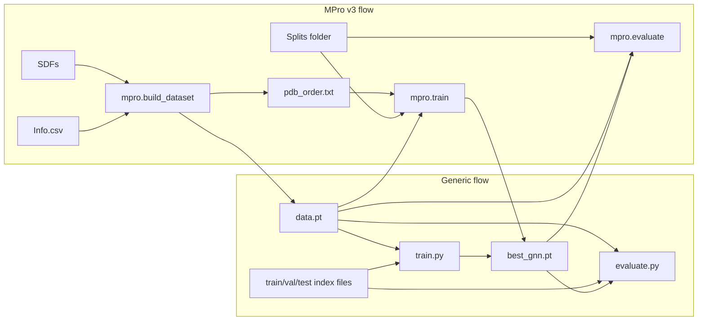
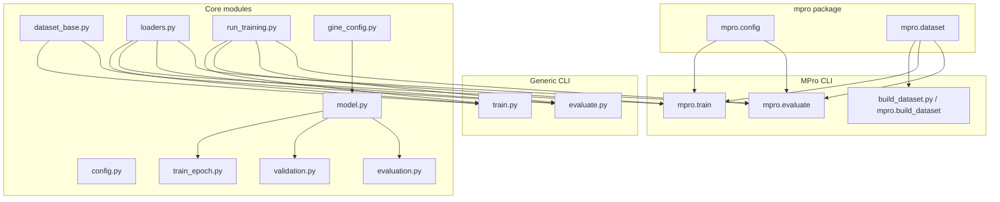

# GNN training for graph classification

Python pipeline to train a GINE (Graph Isomorphism Network with Edge features) for **graph-level classification**. The codebase is split into:

- **Generic scripts** (`train.py`, `evaluate.py`): work with any PyG dataset and train/val/test index files.
- **MPro v3 scripts** (`mpro` package): build dataset from SDFs + Info.csv, and train/evaluate using MPro split files and folds.

## Overview





## Data (MPro v3)

- **Graphs**: One graph per ligand from `Ligand/Ligand_SDF/*.sdf`. Node features: 3D coordinates (x, y, z) and atomic number. Edges: bonds; edge features: bond type (single=1, double=2, triple=3, aromatic=1.5) for GINE.
- **Labels**: `Info.csv` provides `pIC50` and `Category` (-1: pIC50&lt;5.5, 0: 5.5≤pIC50&lt;6.5, 1: pIC50≥6.5). Category is mapped to classes 0, 1, 2.

**Generic datasets**: Any PyG dataset saved as `data.pt` (InMemoryDataset format) with a label attribute (e.g. `y` or `category`) and three index files (one int per line) for train/val/test can be used with `train.py` and `evaluate.py`.

## Setup

Using [uv](https://docs.astral.sh/uv/) (recommended):

```bash
cd gnn_gine_mprov3
uv sync
```

Or with pip:

```bash
pip install -r requirements.txt
```

Requires: PyTorch, PyTorch Geometric, RDKit, pandas, numpy, scikit-learn.

---

## Usage

### Generic flow (any PyG dataset)

You need a **pre-built** `data.pt` (PyG InMemoryDataset format) and **three text files** with train/val/test indices (one integer per line).

#### 1. Train (generic)

```bash
uv run python train.py \
  --data_root /path/to/data \
  --processed_dir processed_pyg \
  --train_indices_file /path/to/train.txt \
  --val_indices_file /path/to/val.txt \
  --test_indices_file /path/to/test.txt \
  --in_channels 4 --num_classes 3 \
  [--label_attr y] [--epochs 100] [--save_path /path/to/best_gnn.pt]
```

- `--label_attr`: batch attribute for labels (default `y`). Your graphs must have this attribute (e.g. `data.y` or `data.category`).
- `--in_channels`, `--num_classes`: must match your dataset.

#### 2. Evaluate (generic)

```bash
uv run python evaluate.py \
  --data_root /path/to/data \
  --processed_dir processed_pyg \
  --test_indices_file /path/to/test.txt \
  --checkpoint /path/to/best_gnn.pt \
  --in_channels 4 --num_classes 3 [--label_attr y]
```

---

### MPro v3 flow

#### 1. Build the PyG dataset (required once)

```bash
# Default data root and dataset name
uv run python build_dataset.py
# or: uv run python -m mpro.build_dataset

# Custom paths
uv run python build_dataset.py --data_root /path/to/MPro-URV_Version3_snapshot --dataset_name processed_pyg
```

Writes `data_root/<dataset_name>/data.pt` and `pdb_order.txt`.

#### 2. Train (MPro)

Train/val/test come from **three files** in `data_root/Splits/` (default: `train_index_folder.txt`, `valid_index_folder.txt`, `test_index_folder.txt`), each with **num_folds** lists of PDB IDs.

```bash
uv run python -m mpro.train [--data_root /path] [--num_folds 5] [--fold_index 0] [--epochs 100]
```

Options: `--dataset_name`, `--train_split_file`, `--val_split_file`, `--test_split_file`, `--num_folds`, `--fold_index`, `--epochs`, `--batch_size`, `--lr`, `--hidden`, `--num_layers`, `--dropout`, `--num_classes`, `--save_path`.

#### 3. Evaluate (MPro)

```bash
uv run python -m mpro.evaluate [--data_root /path] [--checkpoint best_gnn.pt] [--fold_index 0]
```

Use the same fold and architecture as training. Best model is saved as `data_root/best_gnn.pt` by default.

#### Full MPro example

```bash
uv run python build_dataset.py --data_root /path/to/MPro-URV_Version3_snapshot
uv run python -m mpro.train --data_root /path/to/MPro-URV_Version3_snapshot --num_folds 5 --fold_index 0 --epochs 100
uv run python -m mpro.evaluate --data_root /path/to/MPro-URV_Version3_snapshot --checkpoint best_gnn.pt --fold_index 0
```

---

### Programmatic use

**Generic**: use `dataset_base.GenericPyGDataset`, `dataset_base.load_indices_from_file`, `loaders.create_data_loaders(dataset, train_idx, val_idx, test_idx, batch_size)`, and `run_training.run_training` / `run_training.run_evaluation` with `label_attr`.

**MPro**: use `mpro.config.SplitConfig`, `mpro.dataset.MProV3Dataset`, `mpro.dataset.get_train_val_test_indices`, then `loaders.create_data_loaders` and `run_training.run_training(..., label_attr="category")`.

- **`config.TrainingConfig`**: generic training (`epochs`, `batch_size`, `lr`, `seed`). MPro split config: `mpro.config.SplitConfig`.
- **`gine_config.GineConfig`**: GINE architecture; `.build()` → `MProGNN`.
- **`dataset_base.GenericPyGDataset(root, processed_dir)`**: load any `data.pt` from root/processed_dir. **`dataset_base.load_indices_from_file(path)`**: one int per line.
- **`loaders.create_data_loaders(dataset, train_indices, val_indices, test_indices, batch_size)`**: returns `(train_loader, val_loader, test_loader)`.
- **`train_epoch.train_one_epoch(..., label_attr="y")`**, **`validation.evaluate_validation(..., label_attr="y")`**, **`evaluation.evaluate_test(..., label_attr="y")`**: optional label attribute name.
- **`run_training.run_training(...)`**, **`run_training.run_evaluation(...)`**: full training loop and evaluation runner.

---

## Layout

| File / package | Role |
|----------------|------|
| **config.py** | Generic `TrainingConfig` and constants. |
| **dataset_base.py** | `GenericPyGDataset(root, processed_dir)`, `load_indices_from_file(path)`. |
| **loaders.py** | `collate_batch`, `create_data_loaders(dataset, train_idx, val_idx, test_idx, batch_size)`. |
| **run_training.py** | `run_training(...)`, `run_evaluation(...)` (shared by generic and MPro CLIs). |
| **gine_config.py** | `GineConfig`, `.build()` → `MProGNN`. |
| **model.py** | GINE: `MProGNN`. |
| **train_epoch.py** | `train_one_epoch(..., label_attr)`. |
| **validation.py** | `evaluate_validation(..., label_attr)`, `ValidationMetrics`. |
| **evaluation.py** | `evaluate_test(..., label_attr)`, `TestMetrics`, `print_test_report`. |
| **train.py** | Generic CLI: dataset path + index files; saves best model. |
| **evaluate.py** | Generic CLI: dataset path + test index file + checkpoint. |
| **build_dataset.py** | Convenience: runs `mpro.build_dataset.main()`. |
| **mpro/** | MPro v3: `config`, `dataset` (SDF→graph, splits, `MProV3Dataset`), `build_dataset`, `train`, `evaluate`. |
