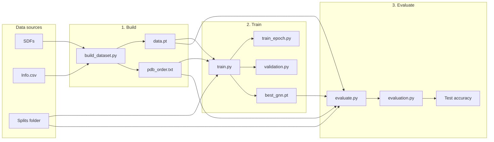
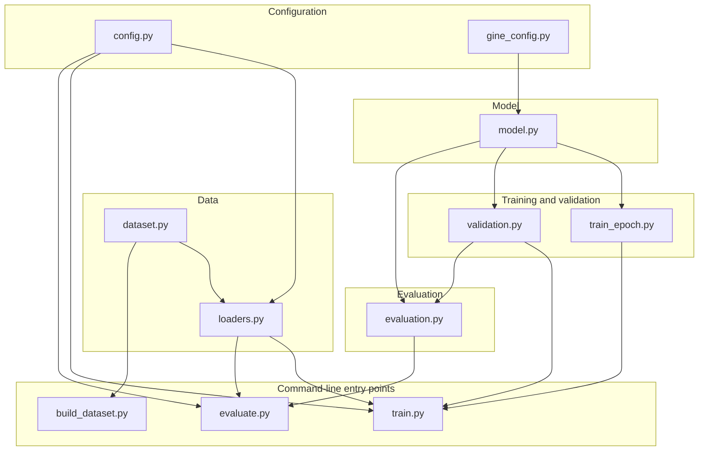

# GNN training for MPro Version 3 data

Python pipeline to train a Graph Neural Network on the MPro-URV Version 3 snapshot for **3-class classification** (Category: low / medium / high potency). The codebase is split into configuration, data loading, GINE model, and separate training, validation, and evaluation logic.

## Overview





## Data

- **Graphs**: One graph per ligand from `Ligand/Ligand_SDF/*.sdf`. Node features: 3D coordinates (x, y, z) and atomic number. Edges: bonds; edge features: bond type (single=1, double=2, triple=3, aromatic=1.5) for GINE.
- **Labels**: `Info.csv` provides `pIC50` and `Category` (-1: pIC50&lt;5.5, 0: 5.5≤pIC50&lt;6.5, 1: pIC50≥6.5). Category is mapped to classes 0, 1, 2.

## Setup

Using [uv](https://docs.astral.sh/uv/) (recommended):

```bash
cd gnn_gine_mprov3
uv sync
```

Or with pip:

```bash
pip install -r requirements.txt
```

Requires: PyTorch, PyTorch Geometric, RDKit, pandas, numpy, scikit-learn, matplotlib.

---

## Usage

### 0. Validate data formats (optional but recommended)

Before building or training, you can run quick checks to ensure that your raw dataset and the generated PyG dataset are compatible with this project.

```bash
# Validate raw input data layout (Info.csv, Ligand_SDF, Splits, basic SDF and label sanity)
uv run python check_input_data_format.py --data_root /path/to/MPro-URV_Version3_snapshot

# Validate a built PyG dataset (data.pt, pdb_order.txt, graph shapes/labels, split indices)
uv run python check_output_data_format.py \
  --data_root /path/to/MPro-URV_Version3_snapshot \
  --dataset_name processed_pyg \
  --num_folds 5 --fold_index 0
```

If any check fails, the script exits with code 1 and prints `[ERROR]` lines explaining the problem.

### 1. Build the PyG dataset (required once)

Train/val/test loaders use a **pre-built** PyG dataset. Create it from SDFs and `Info.csv` before training:

```bash
# Default: data_root = ../MPro-URV_Version3_snapshot, dataset saved as processed_pyg/
uv run python build_dataset.py

# Custom data root and dataset name
uv run python build_dataset.py --data_root /path/to/MPro-URV_Version3_snapshot --dataset_name processed_pyg
```

The dataset is written to `data_root/<dataset_name>/data.pt`. If you skip this step, training will exit with an error telling you to run `build_dataset.py` first.

### 2. Train (train.py)

Train/val/test splits are **always** read from **three files** in `data_root/Splits/`:

- **Default file names**: `train_index_folder.txt`, `valid_index_folder.txt`, `test_index_folder.txt`
- Each file must contain **num_folds** lists of PDB IDs (one list per fold). Default **num_folds** is **5**.

```bash
# Default: data root, default split files, 5 folds, fold 0
uv run python train.py

# Custom data root
uv run python train.py --data_root /path/to/MPro-URV_Version3_snapshot
```

#### PyG dataset and split files

```bash
# Name of the PyG dataset folder to load (must exist; created by build_dataset.py)
uv run python train.py --dataset_name processed_pyg

# Override split file names (defaults: train_index_folder.txt, valid_index_folder.txt, test_index_folder.txt)
uv run python train.py --train_split_file train_index_folder.txt --val_split_file valid_index_folder.txt --test_split_file test_index_folder.txt

# Number of folds (default: 5) and which fold to use (0 .. num_folds-1)
uv run python train.py --num_folds 5 --fold_index 2
```

#### Training options

```bash
# Epochs, batch size, learning rate, seed
uv run python train.py --epochs 150 --batch_size 16 --lr 5e-4 --seed 42

# Number of classes (default 3)
uv run python train.py --num_classes 3
```

#### GINE model (architecture)

```bash
# Hidden size, depth, dropout
uv run python train.py --hidden 128 --num_layers 4 --dropout 0.2
```

#### Full example

```bash
uv run python build_dataset.py --data_root /path/to/MPro-URV_Version3_snapshot
uv run python train.py \
  --data_root /path/to/MPro-URV_Version3_snapshot \
  --dataset_name processed_pyg \
  --num_folds 5 --fold_index 0 \
  --epochs 100 --batch_size 32 --lr 1e-3 \
  --hidden 64 --num_layers 3 --dropout 0.2 \
  --num_classes 3 --seed 42
```

The best model (by validation accuracy) is saved as `best_gnn.pt` in the data root. Training does not run evaluation; use `evaluate.py` for that.

### 3. Evaluate (evaluate.py) — run independently

Evaluate a saved checkpoint on the test set without running training. Use the same split/fold and model architecture as when the model was trained.

```bash
# Default: data_root, checkpoint data_root/best_gnn.pt, fold 0
uv run python evaluate.py

# Custom data root and checkpoint
uv run python evaluate.py --data_root /path/to/snapshot --checkpoint best_gnn.pt

# Same fold and architecture as training
uv run python evaluate.py --data_root /path/to/snapshot --fold_index 2 --hidden 64 --num_layers 3 --num_classes 3
```

Options: `--data_root`, `--dataset_name`, `--checkpoint` (path relative to data_root or absolute), `--train_split_file`, `--val_split_file`, `--test_split_file`, `--num_folds`, `--fold_index`, `--batch_size`, `--hidden`, `--num_layers`, `--dropout`, `--num_classes` (must match the trained model).

### 4. Visualize ligand graphs (visualize_graphs.py)

You can draw a subset of ligand graphs from the built PyG dataset (`data.pt`) and save one image per PDB ID plus a small HTML report containing node/edge tables.

```bash
# Default: first 16 graphs from the default dataset
uv run python visualize_graphs.py

# Specify how many graphs to draw
uv run python visualize_graphs.py --num_graphs 32

# Select by dataset indices
uv run python visualize_graphs.py --indices 0 1 2 10 25

# Select by PDB IDs (requires pdb_order.txt written by build_dataset.py)
uv run python visualize_graphs.py --pdb_ids 5R83 6LU7
```

Output is written under `report/input/graphs`:

- `PDB_ID.png`: 2D drawing of the molecular graph.
- `PDB_ID.html`: report with PDB ID, category, pIC50 (if available), and tables for:
  - nodes (atoms) with atomic number and (x, y, z) coordinates
  - edges (bonds) with bond scalar and bond type:
    - 1.0 → single bond (one solid line)
    - 2.0 → double bond (two solid lines)
    - 3.0 → triple bond (three solid lines)
    - 1.5 → aromatic bond (dashed line)

---

### Programmatic use

You can reuse configs, loaders, and train/val/test logic in your own scripts.

#### Configuration

- **`config.SplitConfig`**: train/val/test file names (`train_file`, `val_file`, `test_file`), `num_folds`, `fold_index`, `dataset_name` (PyG dataset folder).
- **`config.TrainingConfig`**: training run (`epochs`, `batch_size`, `lr`, `seed`).
- **`gine_config.GineConfig`**: GINE architecture (`in_channels`, `hidden_channels`, `num_layers`, `dropout`, `out_classes`). Call `.build()` to get an `MProGNN` instance.

#### Data loaders

- **`loaders.collate_batch(batch)`**: collate list of PyG graphs into a batch (includes category labels; pIC50 still in data for reference).
- **`loaders.create_data_loaders(data_root, split_config, batch_size=32)`**: loads the PyG dataset from `data_root/split_config.dataset_name` (must exist) and returns `(train_loader, val_loader, test_loader)` using the three split files and `fold_index`.

#### Training

- **`train_epoch.train_one_epoch(model, loader, optimizer, device, criterion_ce)`**: one training epoch (cross-entropy); returns mean loss.

#### Validation

- **`validation.evaluate_validation(model, loader, device)`**: returns **`ValidationMetrics`** (`accuracy`).

#### Evaluation

- **`evaluation.evaluate_test(model, loader, device)`**: returns **`TestMetrics`** (`accuracy`).
- **`evaluation.print_test_report(metrics)`**: prints test accuracy.

#### Example script

```python
from pathlib import Path
import torch
from config import SplitConfig, TrainingConfig
from gine_config import GineConfig
from loaders import create_data_loaders
from train_epoch import train_one_epoch
from validation import evaluate_validation
from evaluation import evaluate_test, print_test_report

data_root = Path("/path/to/MPro-URV_Version3_snapshot")
# PyG dataset must exist at data_root/processed_pyg/data.pt (run build_dataset.py first)
split_config = SplitConfig(num_folds=5, fold_index=0, dataset_name="processed_pyg")
training_config = TrainingConfig(epochs=50, batch_size=32, lr=1e-3)
gine_config = GineConfig(hidden_channels=64, num_layers=3, dropout=0.2, out_classes=3)

train_loader, val_loader, test_loader = create_data_loaders(data_root, split_config, training_config.batch_size)
device = torch.device("cuda" if torch.cuda.is_available() else "cpu")
model = gine_config.build().to(device)
optimizer = torch.optim.Adam(model.parameters(), lr=training_config.lr)
criterion_ce = torch.nn.CrossEntropyLoss()

# Training loop (simplified)
for epoch in range(1, training_config.epochs + 1):
    train_one_epoch(model, train_loader, optimizer, device, criterion_ce)
    val_metrics = evaluate_validation(model, val_loader, device)
    # ... save best model by val_metrics.accuracy, etc.

model.load_state_dict(torch.load(data_root / "best_gnn.pt"))
test_metrics = evaluate_test(model, test_loader, device)
print_test_report(test_metrics)
```

---

## Layout

| File | Role |
|------|------|
| **config.py** | Default paths, default split file names, `DEFAULT_PYG_DATASET_NAME`; `SplitConfig`, `TrainingConfig`. |
| **gine_config.py** | GINE config: `GineConfig` dataclass and `.build()` → `MProGNN`. |
| **model.py** | GINE model logic: `MProGNN`. |
| **dataset.py** | Helpers: `sdf_to_graph`, `load_activity_and_category`; `load_splits` (three files); `get_train_val_test_indices`; `MProV3Dataset` (loads pre-built PyG dataset, errors if missing). |
| **build_dataset.py** | Builds PyG dataset from SDFs and saves to `data_root/<dataset_name>/data.pt`. Run once before training. |
| **check_input_data_format.py** | CLI: validate that a raw dataset at `--data_root` has the expected files (Info.csv, Ligand_SDF, Splits) and that SDFs/labels/splits can be parsed. |
| **check_output_data_format.py** | CLI: validate that a built PyG dataset (`data.pt`) and `pdb_order.txt` are present and compatible with the training/evaluation code (graph shapes, labels, split indices). |
| **loaders.py** | `collate_batch`, `create_data_loaders` (require existing PyG dataset). |
| **train_epoch.py** | One-epoch training step: `train_one_epoch`. |
| **validation.py** | Validation: `evaluate_validation`, `ValidationMetrics`. |
| **evaluation.py** | Evaluation: `evaluate_test`, `TestMetrics`, `print_test_report`. |
| **train.py** | CLI: train only; saves best checkpoint. |
| **evaluate.py** | CLI: load a checkpoint and evaluate on the test set (no training). |
